<div align="center">

# 👨‍💻 Davi Mak

### Software Engineering Student • Full-Stack Developer


</div>

---


## 👨‍💻 About Me

I'm a **Software Engineering student** and **Full-Stack Developer** with a strong interest in **backend development** and software architecture.

My main focus is building applications with **C#, .NET and ASP.NET Core**, working with databases, APIs and cloud environments.

I'm constantly learning and improving my skills through academic projects, personal projects and practical development.

* 🎓 Software Engineering student
* 💻 Full-Stack Developer with backend focus
* ⚙️ Passionate about **C# and .NET**
* 🗄️ Experience with **MySQL and SQL**
* ☁️ Exploring **Google Cloud Platform**
* 🐳 Working with **Docker**
* 🚀 Always learning new technologies

<br clear="both">

---

## 🛠️ Technologies & Tools

### 💻 Languages

<p align="left">


</p>

### ⚙️ Frameworks & Development

<p align="left">


</p>

### 🗄️ Databases & Cloud

<p align="left">


</p>

---

## 📊 GitHub Statistics

<div align="center">





</div>

---

## 🐍 Contribution Snake

<div align="center">


</div>

---

## 📈 My Development Journey

```text
Software Engineering
        │
        ├── Backend Development
        │      ├── C#
        │      ├── .NET
        │      └── ASP.NET Core
        │
        ├── Databases
        │      ├── MySQL
        │      └── SQL
        │
        ├── Frontend
        │      ├── HTML
        │      ├── CSS
        │      ├── JavaScript
        │      └── Bootstrap
        │
        └── Cloud & DevOps
               ├── Docker
               ├── Git
               └── Google Cloud
```

---

## 🎯 Currently Learning

* 🏗️ Software architecture
* ⚙️ Advanced .NET development
* 🌐 REST APIs and backend architecture
* ☁️ Cloud deployment
* 🐳 Containerization with Docker
* 🗄️ Database design and optimization
* 📚 Software engineering best practices

---

## 📫 Connect With Me

<div align="center">

<a href="https://github.com/DaviMak">

</a>

</div>

---

<div align="center">

### 💻 Code. Learn. Build. Repeat.


</div>
